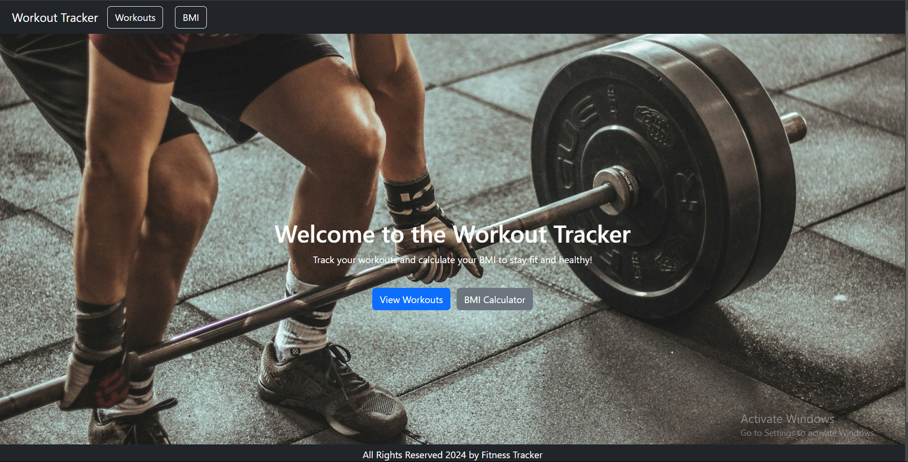
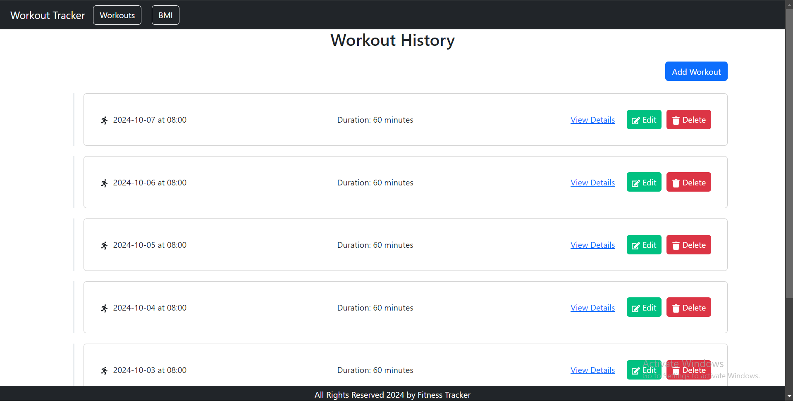
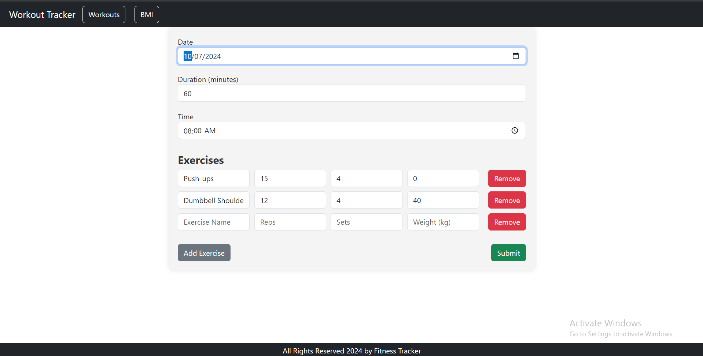
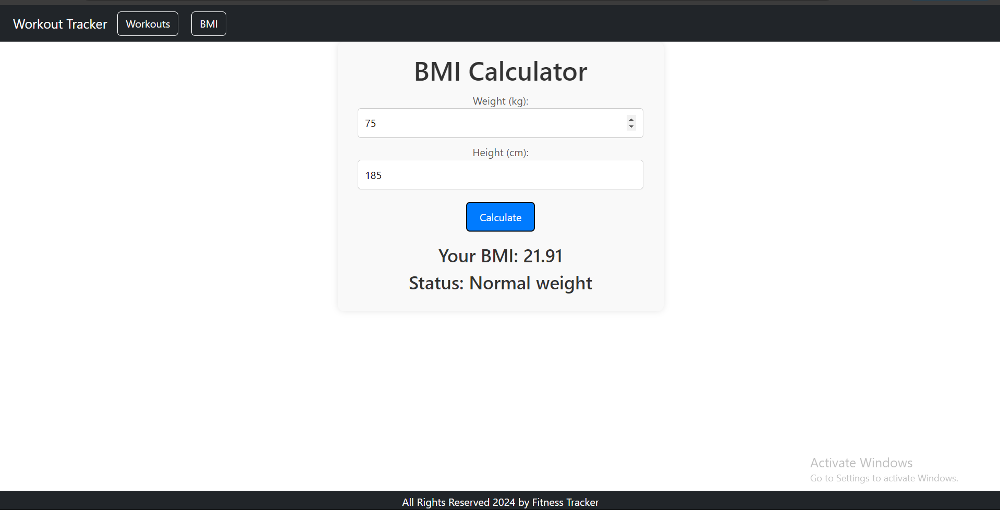
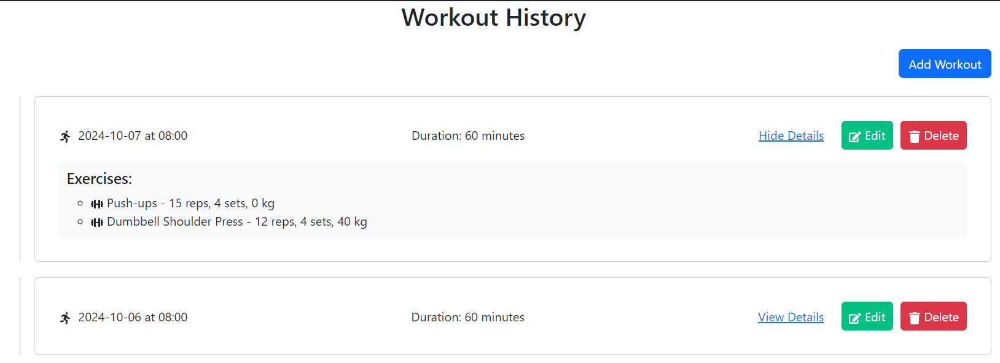

# Workout Tracker Web Application

The **Workout Tracker App** is a streamlined solution designed to help fitness enthusiasts easily manage and track their workout routines. The app allows users to log their workouts, view detailed information about their exercise sessions, and calculate their Body Mass Index (BMI) in a user-friendly interface. With options to add, edit, and delete workouts, users can stay organized and monitor their fitness progress over time.

## Features

### 1. Home Page:
- An intuitive home page featuring a navbar for easy navigation across different sections of the app.
- Carousel display for quick access to key information.
- Fixed footer at the bottom of the screen, visible on all pages.

  
  
### 2. Workout List Page:
- View a timeline of previous workouts, sorted by date with the most recent workout at the top.
- Each workout includes details like time, duration, and the exercises performed (including reps, sets, and weight).
- Buttons to add, edit, or delete workout sessions.

  

### 3. Adding/Editing Workouts:
- Users can log new workout sessions or update existing ones.
- Add multiple exercises to a workout, specifying the name, sets, reps, and weight for each.
- Validation ensures accurate input for exercise details.

   

### 4. BMI Calculator:
- A simple tool for calculating your BMI based on weight and height inputs.
- Instant feedback on your BMI category (underweight, normal, overweight, etc.).

   

### 5. Workout Detail View:
- View detailed information about each workout, including exercises, reps, sets, and weights used.
- Buttons to edit or delete the workout, allowing for flexible adjustments.

   

## Technologies Used

### Front-End:
- **React.js** for building a responsive and dynamic user interface.
- **React Router** for smooth client-side routing.
- **Axios** for handling HTTP requests.
- **Bootstrap** for styling and responsive design.

### Back-End:
- **Spring Boot** for the server-side application logic.
- **Spring Data JPA** for database operations.
- **H2 Database** for development, **MySQL** for production.
